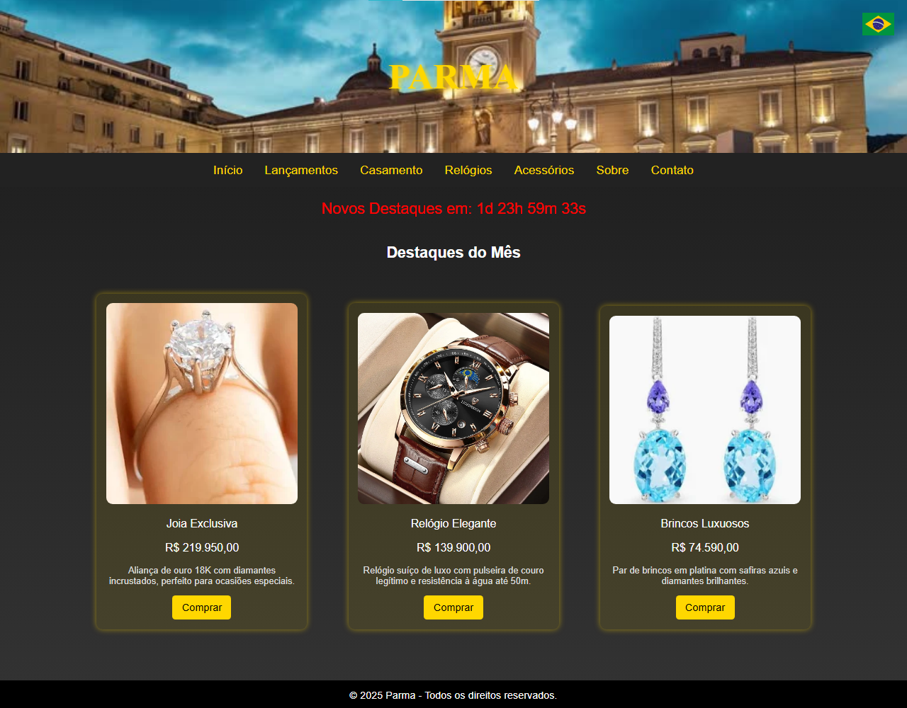

# 🟡 Parma — Interface para Loja de Joias de Luxo

Este projeto é uma **interface web fictícia** desenvolvida com HTML, CSS e JavaScript. Ele foi criado com o objetivo de apresentar visualmente um site de joias e relógios de luxo para um possível comprador ou cliente interessado na proposta visual e na experiência do usuário.

---

## 🎯 Propósito

O site **Parma** foi feito como **protótipo visual**, sem funcionalidades de backend, com foco em:

- Criar **conexão emocional** com o cliente;
- Usar a referência da cidade italiana **Parma** para transmitir **nacionalidade e sofisticação**;
- Transmitir **personalidade visual** de uma marca de luxo, usando tons escuros, dourado e imagens de destaque.

---

## 🖼️ Telas de Apresentação

### Página de Destaques do Mês

  

Apresenta os produtos de forma elegante, com descrições, preços e um botão de compra. A contagem regressiva em vermelho cria uma sensação de urgência.

---

### Página de Contato

A seção de contato exibe telefone, email e endereço da empresa com um design minimalista e luxuoso, reforçando o estilo da marca.

---

## 🧪 Tecnologias Usadas

- HTML5  
- CSS3  
- JavaScript (para o contador de tempo)

---

## ℹ️ Observações

Este site é apenas uma **apresentação visual**, sem funcionalidades dinâmicas ou integração com banco de dados.  
Ideal para demonstração de layout, identidade de marca e proposta de design para clientes.

© 2025 Parma — Projeto educacional.